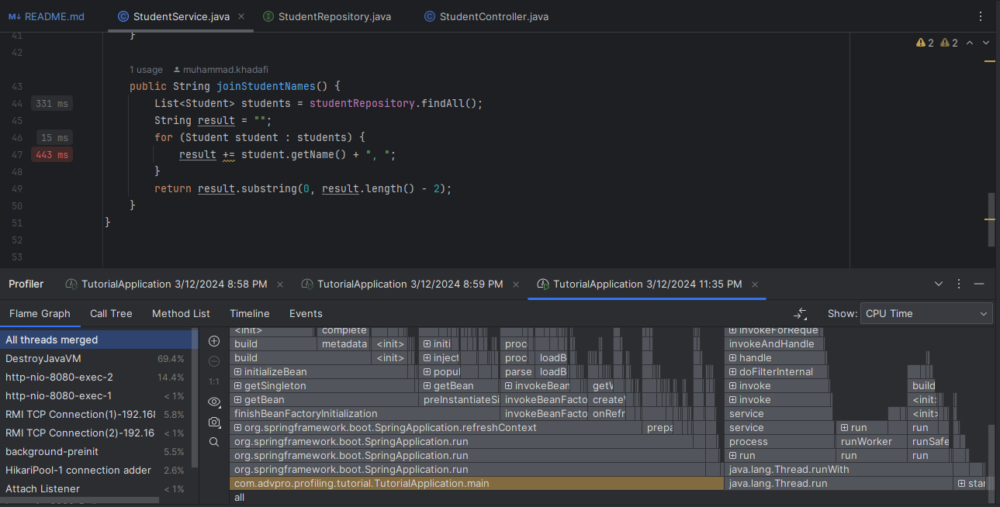
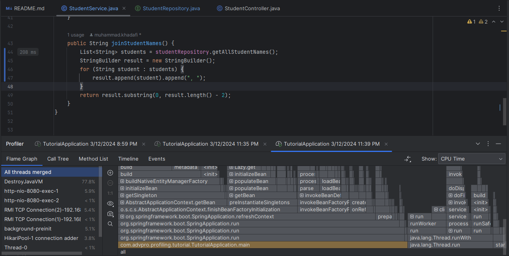
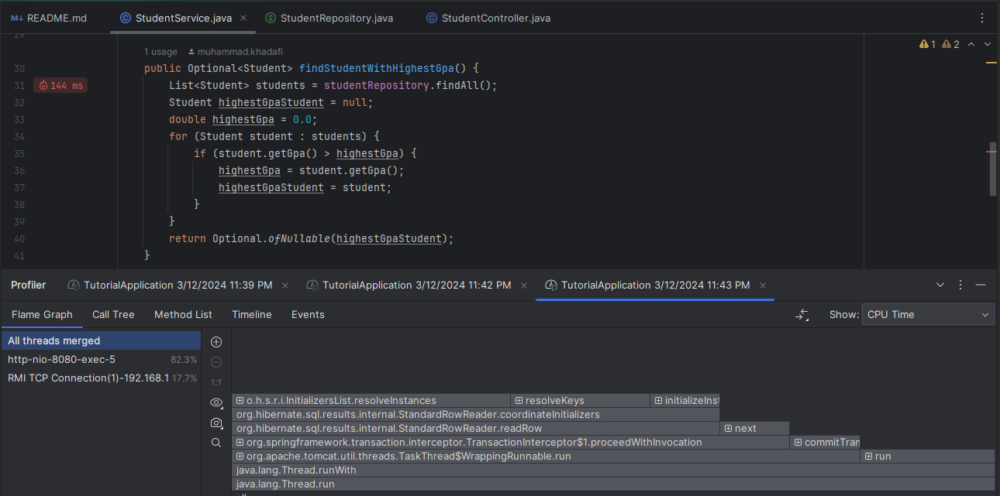

```
Name: Anisa Maharani
NPM: 200648310
```
# Performance Test
## GUI Report Screenshot
### Endpoint: all-student-name
#### 1. View Results Tree:


#### 2. View Results in Table:


#### 3. Summary Report:


#### 4. Graph Results:


### Endpoint: highest-gpa
#### 1. View Results Tree:


#### 2. View Results in Table:


#### 3. Summary Report:


#### 4. Graph Results:


## Console Report Screenshot
### Endpoint: all-student-name
#### 1. Command:
```
jmeter -n -t test-plans/adpro/tutorial-5/1/test_plan_2.jmx -l test-plans/adpro/tutorial-5/1/test_result_2.jtl
```


#### 2. Result:


### Endpoint: highest-gpa
#### 1. Command:
```
jmeter -n -t test-plans/adpro/tutorial-5/1/test_plan_3.jmx -l test-plans/adpro/tutorial-5/1/test_result_3.jtl
```


#### 2. Result:


# Profiling
## Endpoint: all-student
### Before Optimization


### After Optimization

## Endpoint: all-student-name
### Before Optimization


### After Optimization


## Endpoint: highest-gpa
### Before Optimization


### After Optimization
